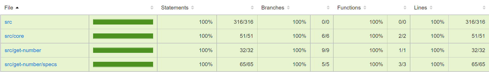

# locale-to-number.js
[](https://github.com/fromScratchStudioGr/locale-to-number.js/blob/main/LICENSE)

Convert string representations of numbers, in a certain locale, to decimal literal numbers.

## Introduction
*locale-to-number.js* is a library that aids developers to convert string representations of numbers, in a certain locale, to decimal literal numbers. The exact opposite operation is available either by the [Intl.NumberFormat()](https://developer.mozilla.org/en-US/docs/Web/JavaScript/Reference/Global_Objects/Intl/NumberFormat/NumberFormat) constructor or the [Number.toLocaleString()](https://developer.mozilla.org/en-US/docs/Web/JavaScript/Reference/Global_Objects/Object/toLocaleString) function. However, converting them back to decimal is not trivial. That's where *locale-to-number.js* comes into play.

For more details, check the [Wiki](https://github.com/fromScratchStudioGr/locale-to-number.js/wiki) page.

## Examples
The library is pretty straight forward, since it is the inverse of the [Number.toLocaleString()](https://developer.mozilla.org/en-US/docs/Web/JavaScript/Reference/Global_Objects/Object/toLocaleString) utility.

You have to provide the string representation of the number alongside the locale into the `getNumber()` function. The supported locales can be found [here](https://github.com/fromScratchStudioGr/locale-to-number.js/wiki/Supported-Locales).

```Javascript
const getNumber = require('@fromscratch-studio-gr/locale-to-number.js');

// English Locale.
console.log(getNumber('0.0', 'en'));
// Prints: 0

console.log(getNumber('0.45', 'en'));
// Prints: 0.45

console.log(getNumber('0.243225', 'en'));
// Prints: 0.243225

console.log(getNumber('2,050', 'en'));
// Prints: 2050

console.log(getNumber('+12,054,100.55', 'en'));
// Prints: 12054100.55

console.log(getNumber('-12054100.55', 'en'));
// Prints: -12054100.55

// Greek Locale.
console.log(getNumber('+2.342,0', 'el'));
// Prints: 2342

console.log(getNumber('+2.000.000', 'el'));
// Prints: 2000000

console.log(getNumber('-12.054.100,55', 'el'));
// Prints: -12054100.55
```

You can, also, include the corresponding country code.

```Javascript
// Indian English Locale.
console.log(getNumber('2,342.0', 'en-IN'));
// Prints: 2342

console.log(getNumber('2,00,000', 'en-IN'));
// Prints: 200000

console.log(getNumber('+1,20,54,100.55', 'en-IN'));
// Prints: 12054100.55
```

Keep in mind, we currently support up to 19 fraction digits when decimals numbers are used.

## Testing Coverage



## Contributing
Thinking of contributing to the project? Read the instructions [here](https://github.com/fromScratchStudioGr/locale-to-number.js/wiki/Contributing).

## License
locale-to-number.js is available under the [MIT license](https://opensource.org/licenses/MIT).
